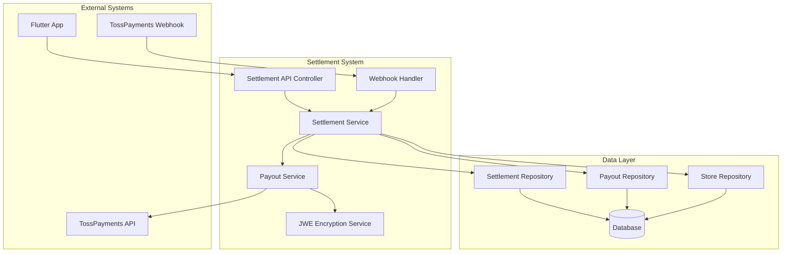

# Design Document

## Overview

짐 보관 플랫폼의 정산 시스템은 여행객이 가게에 짐을 맡기는 서비스에서 발생하는 수익을 플랫폼과 가게 간에 정산하는 핵심 기능입니다. 시스템은 20% 플랫폼 수수료(PG사 수수료 포함)를 자동으로 계산하고, 토스페이먼츠 지급대행 API를 통해 가게에 정산금을 송금합니다.

### 핵심 비즈니스 로직
- 플랫폼 수수료: 20% (PG사 수수료 포함)
- 가게 정산금: 80%
- 송금 방식: 토스페이먼츠 지급대행 API
- 보안: JWE 암호화 적용

## Architecture

### 시스템 아키텍처


### 레이어 구조
- **Controller Layer**: REST API 엔드포인트 제공
- **Service Layer**: 비즈니스 로직 처리
- **Repository Layer**: 데이터 접근 계층
- **External Integration**: 토스페이먼츠 API 연동

## Components and Interfaces

### 1. 도메인 모델

#### Settlement (정산 엔티티)
```java
@Entity
@Table(name = "settlements")
public class Settlement {
    @Id
    private String id;
    
    @ManyToOne(fetch = FetchType.LAZY)
    @JoinColumn(name = "store_id")
    private Store store;
    
    @Column(name = "order_id")
    private String orderId;
    
    @Column(name = "original_amount")
    private BigDecimal originalAmount;        // 원본 결제 금액
    
    @Column(name = "platform_fee_rate")
    private BigDecimal platformFeeRate;       // 플랫폼 수수료율 (0.20)
    
    @Column(name = "platform_fee")
    private BigDecimal platformFee;           // 플랫폼 수수료 금액
    
    @Column(name = "settlement_amount")
    private BigDecimal settlementAmount;      // 정산 금액 (가게 수령액)
    
    @Enumerated(EnumType.STRING)
    @Column(name = "status")
    private SettlementStatus status;
    
    @Column(name = "toss_payout_id")
    private String tossPayoutId;              // 토스 지급대행 ID
    
    @Column(name = "toss_seller_id")
    private String tossSellerId;              // 토스 셀러 ID
    
    @Column(name = "requested_at")
    private LocalDateTime requestedAt;
    
    @Column(name = "completed_at")
    private LocalDateTime completedAt;
    
    @Column(name = "error_message")
    private String errorMessage;
    
    @Column(name = "retry_count")
    private Integer retryCount = 0;
    
    @Column(name = "metadata", columnDefinition = "TEXT")
    private String metadata;                  // JSON 형태의 추가 정보
}
```

#### TossSeller (토스 셀러 정보)
```java
@Entity
@Table(name = "toss_sellers")
public class TossSeller {
    @Id
    private String id;
    
    @OneToOne(fetch = FetchType.LAZY)
    @JoinColumn(name = "store_id")
    private Store store;
    
    @Column(name = "ref_seller_id")
    private String refSellerId;               // 우리 시스템의 셀러 ID
    
    @Column(name = "toss_seller_id")
    private String tossSellerId;              // 토스에서 발급한 셀러 ID
    
    @Enumerated(EnumType.STRING)
    @Column(name = "business_type")
    private TossBusinessType businessType;
    
    @Enumerated(EnumType.STRING)
    @Column(name = "status")
    private TossSellerStatus status;
    
    @Column(name = "registered_at")
    private LocalDateTime registeredAt;
    
    @Column(name = "approved_at")
    private LocalDateTime approvedAt;
}
```

### 2. 서비스 컴포넌트

#### SettlementService
```java
@Service
@Transactional
public class SettlementService {
    
    /**
     * 정산 계산 및 생성
     */
    public Settlement createSettlement(String storeId, String orderId, BigDecimal originalAmount);
    
    /**
     * 정산 처리 요청
     */
    public void processSettlement(String settlementId);
    
    /**
     * 정산 내역 조회
     */
    public Page<Settlement> getSettlements(String storeId, LocalDate startDate, LocalDate endDate, Pageable pageable);
    
    /**
     * 정산 상태 업데이트 (웹훅 처리)
     */
    public void updateSettlementStatus(String tossPayoutId, TossPayoutStatus status, String errorMessage);
}
```

#### TossPayoutService
```java
@Service
public class TossPayoutService {
    
    /**
     * 셀러 등록
     */
    public TossSellerResponse registerSeller(Store store);
    
    /**
     * 정산 잔액 조회
     */
    public TossBalanceResponse getBalance();
    
    /**
     * 지급대행 요청
     */
    public TossPayoutResponse requestPayout(Settlement settlement);
    
    /**
     * 지급대행 취소
     */
    public void cancelPayout(String tossPayoutId);
}
```

#### JweEncryptionService
```java
@Service
public class JweEncryptionService {
    
    /**
     * JWE 암호화
     */
    public String encrypt(Object payload, String securityKey);
    
    /**
     * JWE 복호화
     */
    public <T> T decrypt(String encryptedData, String securityKey, Class<T> targetClass);
}
```

### 3. API 컨트롤러

#### SettlementController
```java
@RestController
@RequestMapping("/api/v1/settlements")
public class SettlementController {
    
    @PostMapping
    public ResponseEntity<SettlementResponse> createSettlement(@RequestBody CreateSettlementRequest request);
    
    @PostMapping("/{settlementId}/process")
    public ResponseEntity<Void> processSettlement(@PathVariable String settlementId);
    
    @GetMapping
    public ResponseEntity<Page<SettlementResponse>> getSettlements(
        @RequestParam String storeId,
        @RequestParam(required = false) LocalDate startDate,
        @RequestParam(required = false) LocalDate endDate,
        Pageable pageable
    );
    
    @GetMapping("/balance")
    public ResponseEntity<BalanceResponse> getBalance();
}
```

#### TossWebhookController
```java
@RestController
@RequestMapping("/api/webhooks/toss")
public class TossWebhookController {
    
    @PostMapping("/payout-changed")
    public ResponseEntity<Void> handlePayoutChanged(@RequestBody TossWebhookEvent event);
    
    @PostMapping("/seller-changed")
    public ResponseEntity<Void> handleSellerChanged(@RequestBody TossWebhookEvent event);
}
```

## Data Models

### 정산 상태 (SettlementStatus)
```java
public enum SettlementStatus {
    PENDING,        // 정산 대기
    PROCESSING,     // 처리 중
    COMPLETED,      // 완료
    FAILED,         // 실패
    CANCELLED       // 취소
}
```

### 토스 셀러 상태 (TossSellerStatus)
```java
public enum TossSellerStatus {
    APPROVAL_REQUIRED,    // 승인 필요 (개인사업자)
    PARTIALLY_APPROVED,   // 부분 승인 (1천만원 미만)
    KYC_REQUIRED,        // KYC 심사 필요
    APPROVED             // 완전 승인
}
```

### 토스 비즈니스 타입 (TossBusinessType)
```java
public enum TossBusinessType {
    INDIVIDUAL_BUSINESS, // 개인사업자
    CORPORATE           // 법인사업자
}
```

### DTO 클래스들 (Flutter json_serializable 호환)

#### API 요청용 DTO

##### SettlementRequest
```java
@Getter @Setter @NoArgsConstructor @AllArgsConstructor
public class SettlementRequest {
    @NotBlank(message = "가게 ID는 필수입니다")
    private String storeId;
    
    @NotBlank(message = "주문 ID는 필수입니다")
    private String orderId;
    
    @NotNull @Positive
    private BigDecimal originalAmount;
    
    private String metadata; // JSON 문자열
}
```

##### TossSellerRequest
```java
@Getter @Setter @NoArgsConstructor @AllArgsConstructor
public class TossSellerRequest {
    @NotBlank(message = "가게 ID는 필수입니다")
    private String storeId;
    
    @NotNull(message = "사업자 타입은 필수입니다")
    private TossBusinessType businessType;
}
```

#### API 응답용 DTO

##### SettlementResponse
```java
@Getter @Setter @NoArgsConstructor @AllArgsConstructor
public class SettlementResponse {
    private String id;
    private String storeId;
    private String orderId;
    private BigDecimal originalAmount;
    private BigDecimal platformFeeRate;
    private BigDecimal platformFee;
    private BigDecimal settlementAmount;
    private SettlementStatus status;
    private String tossPayoutId;
    private String tossSellerId;
    private LocalDateTime requestedAt;
    private LocalDateTime completedAt;
    private String errorMessage;
    private Integer retryCount;
    private LocalDateTime createdAt;
    private LocalDateTime updatedAt;
    
    // 엔티티로부터 DTO 생성
    public static SettlementResponse from(Settlement settlement);
}
```

##### TossSellerResponse
```java
@Getter @Setter @NoArgsConstructor @AllArgsConstructor
public class TossSellerResponse {
    private String id;
    private String storeId;
    private String refSellerId;
    private String tossSellerId;
    private TossBusinessType businessType;
    private TossSellerStatus status;
    private LocalDateTime registeredAt;
    private LocalDateTime approvedAt;
    private LocalDateTime createdAt;
    private LocalDateTime updatedAt;
    private boolean canProcessPayout;
    private boolean isPendingApproval;
    
    // 엔티티로부터 DTO 생성
    public static TossSellerResponse from(TossSeller tossSeller);
}
```

##### SettlementSummaryResponse
```java
@Getter @Setter @NoArgsConstructor @AllArgsConstructor
public class SettlementSummaryResponse {
    private String storeId;
    private LocalDate date;
    private BigDecimal totalOriginalAmount;
    private BigDecimal totalPlatformFee;
    private BigDecimal totalSettlementAmount;
    private Long completedCount;
    private Long pendingCount;
    private Long failedCount;
    
    // 정산 요약 정보 생성
    public static SettlementSummaryResponse create(...);
}
```

#### Flutter 연동 특징
- **json_serializable 호환**: 모든 필드가 getter/setter로 접근 가능
- **Validation 어노테이션**: `@NotBlank`, `@NotNull`, `@Positive` 등으로 입력 검증
- **Static factory methods**: `from()` 메서드로 엔티티 → DTO 변환
- **Null-safe**: Flutter의 null safety와 호환되도록 기본값 처리

## Error Handling

### 예외 클래스 계층
```java
public class SettlementException extends RuntimeException {
    private final String errorCode;
    private final String message;
}

public class TossApiException extends SettlementException {
    private final String tossErrorCode;
    private final int httpStatus;
}

public class EncryptionException extends SettlementException {
    // JWE 암호화/복호화 오류
}

public class InsufficientBalanceException extends SettlementException {
    // 잔액 부족 오류
}
```

### 글로벌 예외 처리
```java
@RestControllerAdvice
public class SettlementExceptionHandler {
    
    @ExceptionHandler(SettlementException.class)
    public ResponseEntity<ErrorResponse> handleSettlementException(SettlementException e);
    
    @ExceptionHandler(TossApiException.class)
    public ResponseEntity<ErrorResponse> handleTossApiException(TossApiException e);
}
```

## Testing Strategy

### 단위 테스트
- **Service Layer**: 비즈니스 로직 테스트
- **Repository Layer**: 데이터 접근 테스트
- **Encryption Service**: JWE 암호화/복호화 테스트

### 통합 테스트
- **API Controller**: REST API 엔드포인트 테스트
- **Database Integration**: JPA 엔티티 및 쿼리 테스트
- **Toss API Integration**: 토스페이먼츠 API 연동 테스트 (Mock 사용)

### 테스트 전략
```java
@SpringBootTest
@TestPropertySource(properties = {
    "toss.api.base-url=https://api.tosspayments.com",
    "toss.api.secret-key=test_sk_...",
    "toss.api.security-key=test_security_key"
})
class SettlementServiceTest {
    
    @Test
    void 정산_계산_테스트() {
        // Given: 원본 금액 10,000원
        // When: 정산 계산 수행
        // Then: 플랫폼 수수료 2,000원, 정산 금액 8,000원
    }
    
    @Test
    void 토스_지급대행_요청_테스트() {
        // Given: 정산 데이터
        // When: 지급대행 요청
        // Then: 토스 API 호출 및 응답 처리
    }
}
```

### Mock 테스트 설정
```java
@MockBean
private TossPayoutService tossPayoutService;

@Test
void 지급대행_실패_재시도_테스트() {
    // Given: 지급대행 실패 시나리오
    when(tossPayoutService.requestPayout(any()))
        .thenThrow(new TossApiException("INSUFFICIENT_BALANCE"));
    
    // When & Then: 재시도 로직 검증
}
```

## 보안 고려사항

### JWE 암호화
- 토스페이먼츠 보안 키를 사용한 A256GCM 암호화
- 요청/응답 데이터 암호화
- 보안 키 안전한 저장 (환경변수 또는 암호화된 설정)

### API 보안
- JWT 토큰 기반 인증
- HTTPS 통신 강제
- Rate Limiting 적용

### 데이터 보안
- 민감한 정보 암호화 저장
- 개인정보 마스킹 처리
- 감사 로그 기록

## 성능 최적화

### 데이터베이스 최적화
- 인덱스 설정: store_id, status, created_at
- 페이징 처리로 대용량 데이터 조회 최적화
- 연관관계 지연 로딩 활용

### 캐싱 전략
- 토스 잔액 정보 캐싱 (5분)
- 셀러 정보 캐싱
- Redis 활용한 분산 캐싱

### 비동기 처리
- 지급대행 요청 비동기 처리
- 웹훅 이벤트 비동기 처리
- 재시도 로직 구현

## 코드 품질 및 문서화 가이드라인

### 코드 주석 작성 규칙

#### 1. 클래스 레벨 주석
모든 클래스는 다음 정보를 포함한 JavaDoc 주석을 작성해야 합니다:
```java
/**
 * 정산 정보를 저장하는 엔티티
 * 짐 보관 서비스 이용료에서 플랫폼 수수료(20%)를 차감한 정산 금액을 관리
 * 
 * <p>주요 기능:</p>
 * <ul>
 *   <li>플랫폼 수수료 자동 계산 (20%)</li>
 *   <li>정산 상태 관리 (PENDING → PROCESSING → COMPLETED/FAILED)</li>
 *   <li>토스페이먼츠 지급대행 연동</li>
 * </ul>
 * 
 * @author 개발자명
 * @since 1.0
 * @see TossSeller
 * @see SettlementStatus
 */
@Entity
@Table(name = "settlements")
public class Settlement {
    // 구현 내용...
}
```

#### 2. 메서드 레벨 주석
모든 public 메서드는 다음 정보를 포함해야 합니다:
```java
/**
 * 정산 금액을 계산하는 정적 팩토리 메서드
 * 
 * <p>계산 로직:</p>
 * <ol>
 *   <li>플랫폼 수수료율 20% 적용</li>
 *   <li>플랫폼 수수료 = 원본 금액 × 0.20</li>
 *   <li>정산 금액 = 원본 금액 - 플랫폼 수수료</li>
 * </ol>
 * 
 * @param store 정산 대상 가게 정보 (null 불가)
 * @param orderId 주문 ID (추적용, null 불가)
 * @param originalAmount 원본 결제 금액 (양수여야 함)
 * @return 계산된 정산 정보가 포함된 Settlement 객체
 * @throws IllegalArgumentException 파라미터가 null이거나 금액이 0 이하인 경우
 * @throws ArithmeticException 금액 계산 중 오버플로우 발생 시
 */
public static Settlement createSettlement(Store store, String orderId, BigDecimal originalAmount) {
    // 구현 내용...
}
```

#### 3. 필드 레벨 주석
중요한 필드는 용도와 제약사항을 명시해야 합니다:
```java
/**
 * 원본 결제 금액
 * 고객이 실제로 결제한 전체 금액 (VAT 포함)
 * 
 * <p>제약사항:</p>
 * <ul>
 *   <li>null 불가 (@NotNull)</li>
 *   <li>양수여야 함 (@Positive)</li>
 *   <li>소수점 둘째 자리까지 지원 (precision=19, scale=2)</li>
 * </ul>
 */
@NotNull
@Positive
@Column(name = "original_amount", nullable = false, precision = 19, scale = 2)
private BigDecimal originalAmount;

/**
 * 플랫폼 수수료율
 * 현재 고정값 0.20 (20%, PG사 수수료 포함)
 * 
 * <p>참고:</p>
 * <ul>
 *   <li>향후 가게별 차등 수수료 적용 가능성을 위해 필드로 분리</li>
 *   <li>소수점 넷째 자리까지 지원 (precision=5, scale=4)</li>
 * </ul>
 */
@NotNull
@Column(name = "platform_fee_rate", nullable = false, precision = 5, scale = 4)
private BigDecimal platformFeeRate;
```

#### 4. 복잡한 로직 인라인 주석
복잡한 비즈니스 로직은 단계별로 주석을 추가해야 합니다:
```java
public void processSettlement(Settlement settlement) {
    // 1. 전처리: 정산 가능 상태 검증
    if (!settlement.canProcess()) {
        throw new IllegalStateException("정산 처리 불가능한 상태: " + settlement.getStatus());
    }
    
    // 2. 토스 셀러 정보 조회 및 검증
    TossSeller tossSeller = tossSellerRepository.findByStoreId(settlement.getStore().getId())
        .orElseThrow(() -> new SellerNotFoundException("등록되지 않은 셀러: " + settlement.getStore().getId()));
    
    // 3. 지급대행 가능 여부 확인 (토스 ID 존재 + 승인 상태)
    if (!tossSeller.canProcessPayout()) {
        throw new PayoutNotAllowedException("지급대행 불가능한 셀러 상태: " + tossSeller.getStatus());
    }
    
    // 4. 정산 상태를 처리중으로 변경 (동시성 제어)
    settlement.startProcessing();
    settlementRepository.save(settlement);
    
    try {
        // 5. 토스페이먼츠 지급대행 API 호출
        TossPayoutResponse response = tossPayoutService.requestPayout(settlement, tossSeller);
        
        // 6. 성공 시 정산 완료 처리
        settlement.completeSettlement(response.getPayoutId());
        
    } catch (TossApiException e) {
        // 7. 실패 시 에러 처리 및 재시도 스케줄링
        settlement.failSettlement(e.getMessage());
        
        if (settlement.canRetry()) {
            scheduleRetry(settlement, calculateRetryDelay(settlement.getRetryCount()));
        }
    } finally {
        // 8. 최종 상태 저장
        settlementRepository.save(settlement);
    }
}
```

#### 5. DTO 클래스 주석 (Flutter 호환성 포함)
```java
/**
 * 정산 정보 API 응답용 DTO
 * Flutter json_serializable과 호환되는 구조로 설계
 * 
 * <p>Flutter 연동 특징:</p>
 * <ul>
 *   <li>모든 필드가 getter/setter로 접근 가능</li>
 *   <li>기본 생성자 제공 (json_serializable 요구사항)</li>
 *   <li>LocalDateTime은 ISO 8601 형식으로 직렬화</li>
 *   <li>BigDecimal은 숫자로 직렬화 (문자열 아님)</li>
 * </ul>
 * 
 * <p>JSON 예시:</p>
 * <pre>
 * {
 *   "id": "settlement-123",
 *   "storeId": "store-456",
 *   "originalAmount": 10000,
 *   "platformFee": 2000,
 *   "settlementAmount": 8000,
 *   "status": "COMPLETED",
 *   "createdAt": "2024-01-15T10:30:00"
 * }
 * </pre>
 */
@Getter
@Setter
@NoArgsConstructor
@AllArgsConstructor
public class SettlementResponse {
    // 필드 정의...
}
```

#### 6. Repository 인터페이스 주석
```java
/**
 * Settlement 엔티티를 위한 Repository 인터페이스
 * 정산 데이터의 CRUD 및 커스텀 쿼리 제공
 * 
 * <p>주요 기능:</p>
 * <ul>
 *   <li>가게별 정산 내역 조회 (페이징 지원)</li>
 *   <li>날짜 범위별 정산 내역 조회</li>
 *   <li>상태별 정산 내역 조회</li>
 *   <li>재시도 가능한 실패 정산 조회</li>
 * </ul>
 */
@Repository
public interface SettlementRepository extends JpaRepository<Settlement, String> {
    
    /**
     * 가게별 정산 내역 조회 (최신순 정렬)
     * 
     * <p>사용 사례:</p>
     * <ul>
     *   <li>가게 사장님의 정산 내역 조회</li>
     *   <li>관리자의 가게별 정산 현황 확인</li>
     * </ul>
     * 
     * @param storeId 조회할 가게 ID (null 불가)
     * @param pageable 페이징 정보 (페이지 번호, 크기, 정렬 등)
     * @return 해당 가게의 정산 내역 페이지 (최신순)
     */
    Page<Settlement> findByStoreIdOrderByCreatedAtDesc(String storeId, Pageable pageable);
}
```

#### 7. 테스트 코드 주석
```java
/**
 * Settlement 엔티티 단위 테스트
 * 정산 계산 로직 및 상태 변경 로직 검증
 */
@SpringBootTest
class SettlementTest {
    
    @Test
    @DisplayName("정산 생성 - 20% 수수료 계산 확인")
    void createSettlement_ShouldCalculate20PercentFee() {
        // Given: 테스트 데이터 준비
        BigDecimal originalAmount = new BigDecimal("10000");  // 원본 금액 10,000원
        String orderId = "order-123";
        
        // When: 정산 생성 (20% 수수료 자동 계산)
        Settlement settlement = Settlement.createSettlement(testStore, orderId, originalAmount);
        
        // Then: 계산 결과 검증
        assertThat(settlement.getOriginalAmount()).isEqualByComparingTo(new BigDecimal("10000"));    // 원본: 10,000원
        assertThat(settlement.getPlatformFeeRate()).isEqualByComparingTo(new BigDecimal("0.20"));    // 수수료율: 20%
        assertThat(settlement.getPlatformFee()).isEqualByComparingTo(new BigDecimal("2000"));        // 수수료: 2,000원
        assertThat(settlement.getSettlementAmount()).isEqualByComparingTo(new BigDecimal("8000"));   // 정산액: 8,000원
        assertThat(settlement.getStatus()).isEqualTo(SettlementStatus.PENDING);                      // 초기 상태: PENDING
    }
}
```

### 주석 작성 체크리스트

#### 필수 주석
- [ ] 클래스 목적 및 책임 설명
- [ ] Public 메서드의 파라미터, 반환값, 예외 설명
- [ ] 복잡한 비즈니스 로직의 단계별 설명
- [ ] 중요한 필드의 용도 및 제약사항
- [ ] DTO 클래스의 Flutter 호환성 정보

#### 권장 주석
- [ ] 알고리즘의 시간/공간 복잡도
- [ ] 성능 고려사항 및 최적화 포인트
- [ ] 향후 확장 가능성 및 제약사항
- [ ] 외부 시스템 연동 시 주의사항
- [ ] 테스트 시나리오 및 검증 포인트

이러한 주석 가이드라인을 통해 코드의 가독성과 유지보수성을 크게 향상시킬 수 있습니다.